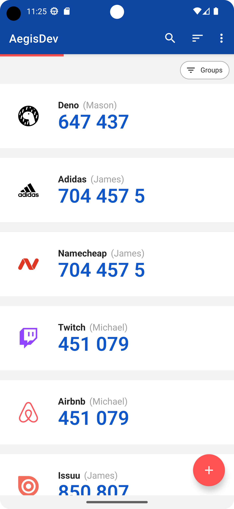

# aegis-simple-icons-outlined

This is an icon pack for the two factor authentication app [Aegis Authenticator](https://github.com/beemdevelopment/aegis) based on [Simple
Icons](https://github.com/simple-icons/simple-icons). This icon pack is a variant on the automatically generated icon pack "[aegis-simple-icons](https://github.com/alexbakker/aegis-simple-icons)" by [alexbakker](https://github.com/alexbakker).

## Screenshot

All credit for the icons belongs to the authors of [Simple
Icons](https://github.com/simple-icons/simple-icons).
